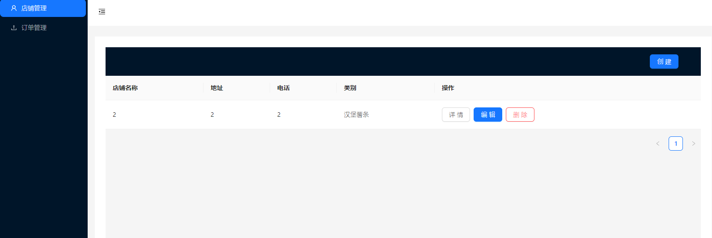
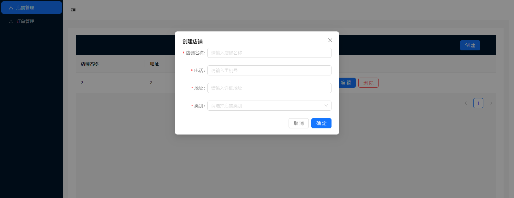
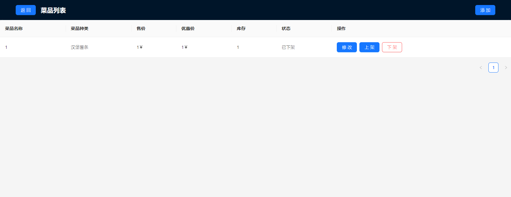
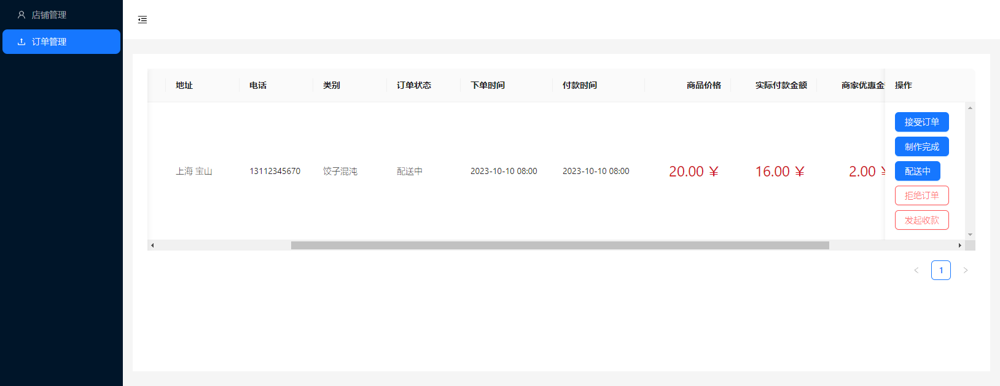

# Installation

```bash
# install package
$ yarn i
```

## Running the app

```bash
# watch mode
$ yarn run start
```

## Interface Display

### Login Page
<p align="center">
  
</p>

### Shop Management
<p align="center">
  
</p>

### Create Modal
<p align="center">
  
</p>

### List Of Dishes
<p align="center">
  
</p>

### Order Management
<p align="center">
  
</p>
